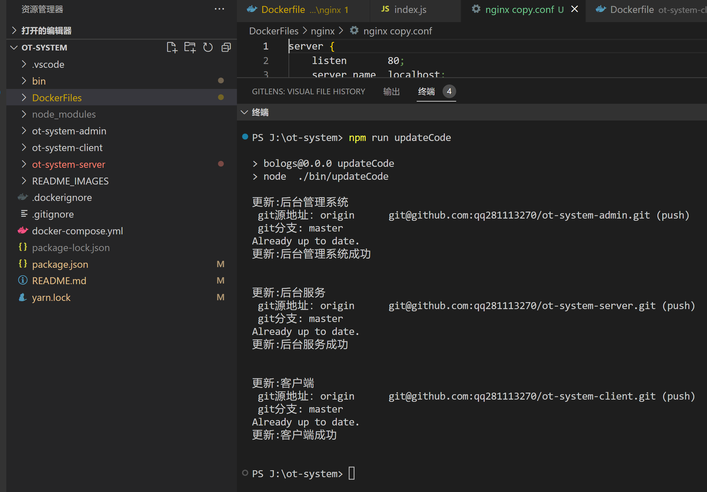
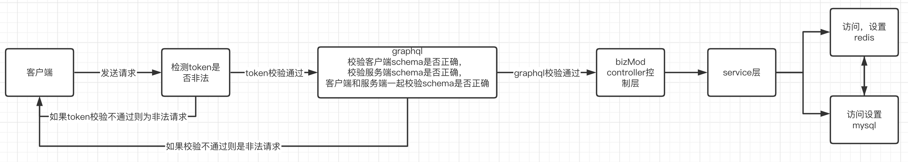
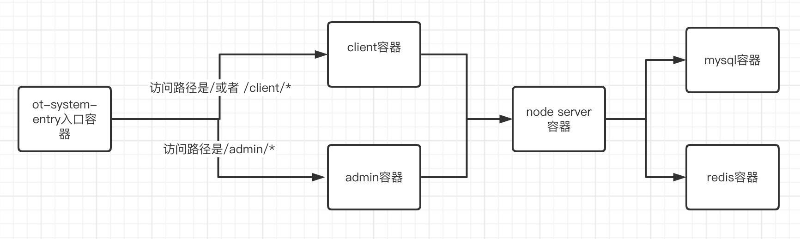

# OT协同文档
##   简介：

 开源ot协同系统是由 姚观寿 业余时间打造的一个开源项目，改项目具有安全性高，实时高效，低延迟，企业级别文档服务，socket实时通信，增量局部文档改动等功能，支持大数据，高并发，集群等部署。

 该项目前后端一键部署，部署功能已经做好docker 和 docker-compose相关配置，部署只需要执行一个shell脚本指令，配置域名ip地址即可部署上线。

该项目可拓展性高，具留有redis 和 mysql相关拓展接口。

该项目是目前开源协同系统最完善的一套系统，可以用来学习ot协同文档只是，或者用于拓展企业级的ot协同文档项目。

## 安装

那接下来我就来安装下这个ot协同文档系统

### 克隆主仓库

下载克隆该项目源码

```
git clone https://github.com/ygs-code/ot-system.git
```

### 安装依赖

克隆完该项目之后，安装依赖包

```
cd ot-system 
npm install
```

安装成功依赖包之后

### 克隆子仓库

因为该ot系统是分为一个主仓库，和 三个 子仓库来搭建的，

主仓库主要是负责管理这三个子仓库，三个子仓库分别是ot-system-admin，ot-system-client，ot-system-server 不难看出这三个仓库分别是后台管理客户端，C端客户端，左后一个是server服务。

这三个子仓库并不需要手动下来可用，因为我已经写好啦 shell 脚本克隆这三个仓库

运行下面改执行即可自动下载代码

```
npm run updateCode
```



运行完之后我们看到项目中多了三个目录。三个仓库分别是后台管理客户端，C端客户端，左后一个是server服务。

### 安装子仓库依赖

接下来我们先来启动server后台服务

首先我们需要安装依赖， cd 进入ot-system-server目录

```
cd ot-system-server
npm install
```

安装依赖成功之后，这个时候还不能启动后台server服务，因为该服务是要依赖 redis和mysql的。

这里如何安装redis和mysql我这里就不多介绍了，这个你们自己百度下。

这里需要注意的是，我node server服务连接的redis和mysql是设置了密码，密码为：123456。端口号没有更改还是保持redis和mysql他们默认的端口号。


然后当然你也可以用docker容器启动redis和mysql，因为我这里已经写好了docker容器配置，这个时候你只需要在docker官网下载一个docker安装包即可。

然后回到最外层目录, 分别需要构建 redis 和 mysql镜像，运行以下指令

```
cd ot-system
npm run publish:redis:mysql
```

这样就可以启动了 redis 和mysql 容器，里面的打包镜像和启动容器我都写好shell脚本了。

### 启动node server服务

进入ot-system-server目录,  需要 启动node 需要两个指令，第一个是先要把他编译成es5代码。因为我在node服务是用了es6 es7 node 对es6和es7不是很友好，所以我自己写了一个webpack脚手架。 所以第一步 运行 build:dev，打包编译 dev环境代码。

```
npm run build:dev
```

打包完成之后启动服务，也可以同时两个指令同时执行，当然在npm run build:dev 运行完之后请不要关闭它，因为他需要时时热编译，这样才能保证代码修改完之后重启服务器，然后得到最新的代码。

启动命令 dev:n, 这个命令是用nodemon来启动node

```
npm run  dev:n
```

当然如果你喜欢用pm2也是可以的 dev:p, 这样就可以用pm2来启动服务器了。

```
npm run dev:p
```


### 启动 client C端客户端

c 端客户端 我是用我自己写的一个 React Ssr框架写的，这个框架牛逼之处就是同时之处CSR和SSR渲染，并且他们同构，而且从CSR切换到SSR  或  者 从SSR 切换 到CSR，并不需要做兼容，只需要稍微改动下 title 和 关键词 即可。

如果有兴趣请看我的ssr框架地址：https://github.com/ygs-code/react-ssr-lazy-loading

启动 c 端客户端，首先需要进入 ot-system-client

```
cd ot-system-client
```

安装依赖

```
npm i
```

CSR  启动客户端 开发

```
npm run start:client:dev
```

当然如果你喜欢SSR，则可以运行 start:ssr:dev 开发

```
npm run start:ssr:dev 
```

此时可以浏览器打开 http://localhost:3002/


### 启动 admin B端后台管理系统端

admin b 端客户端 我是用我自己写的一个 React Ssr框架写的，这个框架牛逼之处就是同时之处CSR和SSR渲染，并且他们同构，而且从CSR切换到SSR  或  者 从SSR 切换 到CSR，并不需要做兼容，只需要稍微改动下 title 和 关键词 即可。

如果有兴趣请看我的ssr框架地址：https://github.com/ygs-code/react-ssr-lazy-loading

启动 c 端客户端，首先需要进入 ot-system-client

```
cd ot-system-admin
```

安装依赖

```
npm i
```

CSR  启动客户端 开发

```
npm run start:client:dev
```

当然如果你喜欢SSR，则可以运行 start:ssr:dev 开发

```
npm run start:ssr:dev 
```

此时可以浏览器打开 http://localhost:3001/


## 技术分析

###  node server端

这套系统 ot-system-server node 服务端用了 node koa，webpack，  graphql ， mysql，redis.

  ot-system-server 是我自己搭建的一个框架，这个框架遵循了mvc 规范。包含有controller ，routes和 service等。http 访问链路增加了graphql。脚手架用了webpack，配置也是我自己写的。webpack与koa，这已经实现了node的热编译刷新，热启动等功能，还支持ts。

这里我使用graphql，graphql刚开始学时候有些复杂，如果你对graphql不熟悉。可能需要花点时间学习下他，

graphql 官网地址:https://graphql.org/,  当然我也写了一些例子，你可以看看 https://github.com/ygs-code/graphql-demo .  

然后我对 graphql再封装了一层，因为我发现graphql，官网的使用，对于企业级模块化开发并不是很友好，并且校验这些没有集成起来，有些零散，然后我基于官方的graphql 封装了一个包    https://github.com/ygs-code/graphql-modules-validate 有兴趣的可以看下，这个解决了graphql企业模块化的一些难题，并且带了客户端和服务器的schema校验。开箱即用。

graphql有他的一定优势，就是减少了前后联调对接沟通，对于过滤一些非法请求，也可以说是提高了一些安全性问题，因为http请求他需要先经过graphql验证通过之后才会做业务查询。


#### http 访问链路

那下面就看看我们的http 访问链路



#### server目录结构

```
ot-system-server
├── Dockerfile     docker 部署文件
├── README.md      说明文档
├── app            app代码
│   ├── __test__   测试文件
│   │   ├── add.js
│   │   └── add.test.js
│   ├── bizMod       业务模块目录
│   │   ├── index.js
│   │   ├── otDocument    ot文档业务模块目录
│   │   │   ├── bizMod
│   │   │   │   └── document    ot文档业务模块目录
│   │   │   │       ├── controller     ot文档业务控制器
│   │   │   │       │   ├── index.js  
│   │   │   │       │   ├── sharedb-server.js   ot文档业务服务
│   │   │   │       │   ├── throttlingStabilization.js
│   │   │   │       │   └── wss-sharedb.js
│   │   │   │       ├── graphql      ot文档业务 graphql
│   │   │   │       │   └── schema       
│   │   │   │       │       ├── index.js
│   │   │   │       │       ├── resolvers   ot文档业务 resolvers
│   │   │   │       │       │   ├── Mutation
│   │   │   │       │       │   │   └── index.js
│   │   │   │       │       │   ├── Query
│   │   │   │       │       │   │   └── index.js
│   │   │   │       │       │   ├── Subscription
│   │   │   │       │       │   │   └── index.js
│   │   │   │       │       │   ├── Union
│   │   │   │       │       │   │   └── index.js
│   │   │   │       │       │   └── index.js
│   │   │   │       │       └── typeDefs
│   │   │   │       │           ├── index.js
│   │   │   │       │           └── typeDefs.graphql
│   │   │   │       ├── index.js
│   │   │   │       ├── router     ot文档业务 router
│   │   │   │       │   └── index.js
│   │   │   │       ├── service    ot文档业务 service
│   │   │   │       │   └── index.js
│   │   │   │       └── sockets    ot文档业务 sockets
│   │   │   │           ├── index.js
│   │   │   │           ├── sharedb-server.js
│   │   │   │           └── wss-sharedb.js
│   │   │   ├── config        ot文档业务 配置
│   │   │   │   ├── constant.js
│   │   │   │   └── index.js
│   │   │   ├── constant       
│   │   │   │   └── index.js
│   │   │   ├── db         ot文档业务 数据库
│   │   │   │   ├── document.js
│   │   │   │   ├── index.js
│   │   │   │   ├── permission.js
│   │   │   │   ├── role.js
│   │   │   │   ├── rolePermission.js
│   │   │   │   ├── sql
│   │   │   │   │   ├── initTable.sql
│   │   │   │   │   └── initTableData.sql
│   │   │   │   ├── user.js
│   │   │   │   └── userRole.js
│   │   │   ├── graphql   ot文档业务 graphql
│   │   │   │   └── schema
│   │   │   │       └── index.js
│   │   │   ├── index.js
│   │   │   ├── redis   ot文档业务 redis
│   │   │   │   ├── document.js
│   │   │   │   ├── index.js
│   │   │   │   └── user.js
│   │   │   ├── router     ot文档业务 router
│   │   │   │   └── index.js
│   │   │   └── utils   ot文档业务 工具方法
│   │   │       ├── common.js
│   │   │       └── index.js
│   │   └── set         设置模块文档业务  
│   │       ├── bizMod       设置模块文档业务  
│   │       │   ├── permission    权限业务  
│   │       │   │   ├── controller   权限业务控制器
│   │       │   │   │   └── index.js
│   │       │   │   ├── graphql      权限业务 graphql
│   │       │   │   │   └── schema
│   │       │   │   │       ├── index.js
│   │       │   │   │       ├── resolvers
│   │       │   │   │       │   ├── Mutation
│   │       │   │   │       │   │   └── index.js
│   │       │   │   │       │   ├── Query
│   │       │   │   │       │   │   └── index.js
│   │       │   │   │       │   ├── Subscription
│   │       │   │   │       │   │   └── index.js
│   │       │   │   │       │   ├── Union
│   │       │   │   │       │   │   └── index.js
│   │       │   │   │       │   └── index.js
│   │       │   │   │       └── typeDefs
│   │       │   │   │           ├── index.js
│   │       │   │   │           └── typeDefs.graphql
│   │       │   │   ├── index.js  
│   │       │   │   ├── router        权限业务 router
│   │       │   │   │   └── index.js
│   │       │   │   └── service        权限业务 service
│   │       │   │       └── index.js
│   │       │   ├── role      角色业务 
│   │       │   │   ├── controller  角色业务 控制器
│   │       │   │   │   └── index.js
│   │       │   │   ├── graphql  角色业务 graphql
│   │       │   │   │   └── schema
│   │       │   │   │       ├── index.js
│   │       │   │   │       ├── resolvers
│   │       │   │   │       │   ├── Mutation
│   │       │   │   │       │   │   └── index.js
│   │       │   │   │       │   ├── Query
│   │       │   │   │       │   │   └── index.js
│   │       │   │   │       │   ├── Subscription
│   │       │   │   │       │   │   └── index.js
│   │       │   │   │       │   ├── Union
│   │       │   │   │       │   │   └── index.js
│   │       │   │   │       │   └── index.js
│   │       │   │   │       └── typeDefs
│   │       │   │   │           ├── index.js
│   │       │   │   │           └── typeDefs.graphql
│   │       │   │   ├── index.js
│   │       │   │   ├── router    角色业务 路由
│   │       │   │   │   └── index.js
│   │       │   │   └── service    角色业务 service
│   │       │   │       └── index.js
│   ├── config          db和redis配置
│   │   ├── constant.js
│   │   ├── db.js
│   │   ├── index.js
│   │   ├── redis.js
│   │   └── token.js
│   ├── constant    常量
│   │   ├── httpCode.js
│   │   └── index.js
│   ├── controller    最外层控制器
│   │   ├── home.js
│   │   ├── index.js
│   │   ├── user.js
│   │   └── verifyCode.js
│   ├── db          数据库配置
│   │   ├── index.js
│   │   ├── mysql.js
│   │   ├── sql
│   │   │   └── initTable.sql
│   │   └── utils.js
│   ├── graphql      最外层 graphql
│   │   ├── graphql-modules-validate
│   │   │   ├── README.md
│   │   │   ├── cjs
│   │   │   │   ├── ValidateGraphql.js
│   │   │   │   ├── ValidateGraphql.js.LICENSE.txt
│   │   │   │   └── ValidateGraphql.js.map
│   │   │   ├── esm
│   │   │   │   └── ValidateGraphql.js
│   │   │   ├── graphqlModules
│   │   │   │   ├── marketing
│   │   │   │   │   ├── index.js
│   │   │   │   │   └── module.js
│   │   │   │   └── user
│   │   │   │       ├── index.js
│   │   │   │       └── module.js
│   │   │   ├── language.js
│   │   │   ├── package.json
│   │   │   ├── test
│   │   │   │   ├── demo.test.js
│   │   │   │   └── modules.test.js
│   │   │   ├── tsconfig.json
│   │   │   └── webpack.config.js
│   │   ├── index.js
│   │   └── schema
│   │       ├── common
│   │       │   ├── index.js
│   │       │   ├── resolvers
│   │       │   │   ├── Mutation
│   │       │   │   │   └── index.js
│   │       │   │   ├── Query
│   │       │   │   │   └── index.js
│   │       │   │   ├── Subscription
│   │       │   │   │   └── index.js
│   │       │   │   └── index.js
│   │       │   └── typeDefs
│   │       │       ├── index.js
│   │       │       └── typeDefs.graphql
│   │       ├── index.js
│   │       └── user
│   │           ├── index.js
│   │           ├── resolvers
│   │           │   ├── Mutation
│   │           │   │   └── index.js
│   │           │   ├── Query
│   │           │   │   └── index.js
│   │           │   ├── Subscription
│   │           │   │   └── index.js
│   │           │   └── index.js
│   │           └── typeDefs
│   │               ├── index.js
│   │               └── typeDefs.graphql
│   ├── index.js
│   ├── middleware     node 中间件
│   │   ├── common.js
│   │   ├── common.min.js
│   │   └── index.js
│   ├── modules   
│   │   └── otServe         ot文档底层算法库
│   │       └── lib
│   │           ├── client
│   │           │   └── index.js
│   │           ├── db
│   │           │   └── index.js
│   │           └── server
│   │               └── index.js
│   ├── redis        最外层 redis 
│   │   ├── index.js
│   │   ├── jsonwebtoken
│   │   │   └── index.js
│   │   ├── jwt.js
│   │   └── redis.js
│   ├── routes     最外层路由
│   │   ├── index.js
│   │   └── noVerifyToken.js
│   ├── service   最外层service
│   │   └── index.js
│   ├── utils  最外层utils
│   │   ├── CheckDataType.js
│   │   ├── common.js
│   │   ├── index.js
│   │   └── throttlingStabilization.js
│   └── view     view 静态文件，但是这个没用到，因为我们用了前后分离
│       ├── graphql.jsx
│       └── renderGraphiQL.js
├── dist          webpack 打包目录
│   ├── index.js
│   ├── index.js.map
│   ├── runtime~index.js
│   └── runtime~index.js.map
├── jest.config.ts     jest配置
├── nodemon.json     
├── package.json
├── scripts              webpack 配置
│   ├── test.js
│   └── webpack
│       ├── config
│       │   ├── bannerPlugin.js   
│       │   ├── defineLoader        自定义webpack Loader 
│       │   │   └── MyExampleWebpackLoader.js
│       │   ├── definePlugin   自定义webpack Plugin  
│       │   │   └── MyExampleWebpackPlugin.js
│       │   ├── index.js
│       │   ├── webpack.base.config.js   基础 webpack 配置  
│       │   ├── webpack.dev.config.js    dev环境 webpack 配置  
│       │   ├── webpack.dll.config.js
│       │   ├── webpack.prd.config.js    生产环境 webpack 配置  
│       │   └── webpack.test.config.js   测试环境 webpack 配置  
│       ├── index.js
│       ├── server.js        webpack server
│       └── utils.js         一些工具方法
├── tsconfig-for-webpack-config.json   ts
├── tsconfig.json
└── yarn.lock
└── .env.development  开发环境  环境变量注入
└── .env.production   生产环境  环境变量注入

```

###  client 客户端

c 端客户端 我是用我自己写的一个 React Ssr框架写的，这个框架牛逼之处就是同时之处CSR和SSR渲染，并且他们同构，而且从CSR切换到SSR  或  者 从SSR 切换 到CSR，并不需要做兼容，只需要稍微改动下 title 和 关键词 即可。

c端 ui框架使用的是谷歌 ui，http 请求 没有使用Axios 因为考虑到node请求，需要做同构，Axios在node请求中支持不友好，然后我自己用xhrHttp 封装了一个请求，同时支持REST和GraphQL请求。

如果有兴趣请看我的ssr框架地址：https://github.com/ygs-code/react-ssr-lazy-loading

  client 客户端没有使用第三方脚手架我自己写了一个，而且支持了webpack 构建微服务。当然目前前端微服务有很多多种方式，

1. 使用 HTTP 服务器的路由来重定向多个应用  比如  ngxin

2. 在不同的框架之上设计通讯、加载机制，诸如 Mooa 和 Single-SPA  如 乾坤

3. 通过组合多个独立应用、组件来构建一个单体应用 

4. iFrame。使用 iFrame 及自定义消息传递机制    如腾讯的擎天

5. 使用纯 webpack 构建 路由 Components 构建应用

6. 纯 Web Components 技术构建


#### 路由实现

   因为我系统需要支持SSR和CSR我其他微服务不好实现，所以选择了webpack 构建微服务。当然比较麻烦的是路由同构，我并没有使用react官方推选的路由库，而是我自己实现了一个react 路由，因为react官方推选的路由库不能支持ssr渲染，也不支持同构，所以只能自己写了。

   我参考啦react官方路由库和webpack 按需加载 promise component 写了一个ssr和csr同构的路由库。

   通过我自己lazy.js 异步加载组件 实现按需加载 和一个 react-lazy-router-dom ssr同构路由包，这样就能实现了SSR和CSR同构

 路由的webpack构架微服务实现我自己写了个webpack-plugin-router插件，能够读取每个模块的 routesConfig.js 配置，然后编译成一个react可识别的组件，说白了就是用shell脚本自动引入组件文件，不需要手工添加，这样routesConfig.js 配置只需要配置就可以

```
// 路由配置
export default [
  {
    path: "/",
    exact: true,
    name: "~index", // 特殊路由
    entry: "/pages/Index/pages/Home",
    level: 2
  },
  {
    path: "/home",
    exact: true,
    name: "home",
    entry: "/pages/Index/pages/Home",
    level: 2
  }
];

```

编译后生成一个routesComponent.js

```
// 按需加载插件
import pagesIndexPagesOfficeRouterRoutesconfig from "client/pages/Index/pages/office/router/routesConfig.js";
import pagesIndexPagesSystemRouterRoutesconfig from "client/pages/Index/pages/system/router/routesConfig.js";
import pagesIndexRouterRoutesconfig from "client/pages/Index/router/routesConfig.js";
import { lazy } from "client/router/react-lazy-router-dom";
import routerRoutesconfig from "client/router/routesConfig.js";

let routesComponentConfig = [
  {
    path: "/office/document/details/:action/:id?",
    exact: false,
    name: "documentDetails",
    entry: "/pages/Index/pages/office/pages/Document/details/index.js",
    Component: lazy(() =>
      import(
        /* webpackChunkName:"documentDetails" */ "client/pages/Index/pages/office/pages/Document/details/index.js"
      )
    ),
    //  syncComponent:Documentdetails,
    level: 2,
    routesConfigPath:
      "/Users/admin/Documents/code/ot-system/ot-system-admin/client/pages/Index/pages/office/router/routesConfig.js"
  },
  {
    path: "/office/document",
    exact: false,
    name: "document",
    entry: "/pages/Index/pages/office/pages/Document/index.js",
    Component: lazy(() =>
      import(
        /* webpackChunkName:"document" */ "client/pages/Index/pages/office/pages/Document/index.js"
      )
    ),
    //  syncComponent:Document,
    level: 2,
    routesConfigPath:
      "/Users/admin/Documents/code/ot-system/ot-system-admin/client/pages/Index/pages/office/router/routesConfig.js"
  },
  {
    path: "/office",
    exact: true,
    name: "office",
    entry: "/pages/Index/pages/office/index.js",
    Component: lazy(() =>
      import(
        /* webpackChunkName:"office" */ "client/pages/Index/pages/office/index.js"
      )
    ),
    //  syncComponent:Office,
    level: 2,
    routesConfigPath:
      "/Users/admin/Documents/code/ot-system/ot-system-admin/client/pages/Index/pages/office/router/routesConfig.js"
  },
  {
    path: "/system/user-management/details/:action/:id?",
    exact: false,
    name: "userManagementDetails",
    entry: "/pages/Index/pages/system/pages/UserManagement/details/index.js",
    Component: lazy(() =>
      import(
        /* webpackChunkName:"userManagementDetails" */ "client/pages/Index/pages/system/pages/UserManagement/details/index.js"
      )
    ),
    //  syncComponent:Usermanagementdetails,
    level: 2,
    routesConfigPath:
      "/Users/admin/Documents/code/ot-system/ot-system-admin/client/pages/Index/pages/system/router/routesConfig.js"
  },
  {
    path: "/system/user-management",
    exact: false,
    name: "userManagement",
    entry: "/pages/Index/pages/system/pages/UserManagement/index.js",
    Component: lazy(() =>
      import(
        /* webpackChunkName:"userManagement" */ "client/pages/Index/pages/system/pages/UserManagement/index.js"
      )
    ),
    //  syncComponent:Usermanagement,
    level: 2,
    routesConfigPath:
      "/Users/admin/Documents/code/ot-system/ot-system-admin/client/pages/Index/pages/system/router/routesConfig.js"
  },
  {
    path: "/system/role-management/details/:action/:id?",
    exact: false,
    name: "roleManagementDetails",
    entry: "/pages/Index/pages/system/pages/RoleManagement/details/index.js",
    Component: lazy(() =>
      import(
        /* webpackChunkName:"roleManagementDetails" */ "client/pages/Index/pages/system/pages/RoleManagement/details/index.js"
      )
    ),
    //  syncComponent:Rolemanagementdetails,
    level: 2,
    routesConfigPath:
      "/Users/admin/Documents/code/ot-system/ot-system-admin/client/pages/Index/pages/system/router/routesConfig.js"
  },
  {
    path: "/system/role-management",
    exact: false,
    name: "roleManagement",
    entry: "/pages/Index/pages/system/pages/RoleManagement/index.js",
    Component: lazy(() =>
      import(
        /* webpackChunkName:"roleManagement" */ "client/pages/Index/pages/system/pages/RoleManagement/index.js"
      )
    ),
    //  syncComponent:Rolemanagement,
    level: 2,
    routesConfigPath:
      "/Users/admin/Documents/code/ot-system/ot-system-admin/client/pages/Index/pages/system/router/routesConfig.js"
  },
  {
    path: "/system/permission-management/details/:action/:id?",
    exact: false,
    name: "permissionManagementDetails",
    entry:
      "/pages/Index/pages/system/pages/PermissionManagement/details/index.js",
    Component: lazy(() =>
      import(
        /* webpackChunkName:"permissionManagementDetails" */ "client/pages/Index/pages/system/pages/PermissionManagement/details/index.js"
      )
    ),
    //  syncComponent:Permissionmanagementdetails,
    level: 2,
    routesConfigPath:
      "/Users/admin/Documents/code/ot-system/ot-system-admin/client/pages/Index/pages/system/router/routesConfig.js"
  },
  {
    path: "/system/permission-management",
    exact: false,
    name: "permissionManagement",
    entry: "/pages/Index/pages/system/pages/PermissionManagement/index.js",
    Component: lazy(() =>
      import(
        /* webpackChunkName:"permissionManagement" */ "client/pages/Index/pages/system/pages/PermissionManagement/index.js"
      )
    ),
    //  syncComponent:Permissionmanagement,
    level: 2,
    routesConfigPath:
      "/Users/admin/Documents/code/ot-system/ot-system-admin/client/pages/Index/pages/system/router/routesConfig.js"
  },
  {
    path: "/system/user-role/details/:action/:id?",
    exact: false,
    name: "userRoleDetails",
    entry: "/pages/Index/pages/system/pages/UserRole/details/index.js",
    Component: lazy(() =>
      import(
        /* webpackChunkName:"userRoleDetails" */ "client/pages/Index/pages/system/pages/UserRole/details/index.js"
      )
    ),
    //  syncComponent:Userroledetails,
    level: 2,
    routesConfigPath:
      "/Users/admin/Documents/code/ot-system/ot-system-admin/client/pages/Index/pages/system/router/routesConfig.js"
  },
  {
    path: "/system/user-role",
    exact: false,
    name: "userRole",
    entry: "/pages/Index/pages/system/pages/UserRole/index.js",
    Component: lazy(() =>
      import(
        /* webpackChunkName:"userRole" */ "client/pages/Index/pages/system/pages/UserRole/index.js"
      )
    ),
    //  syncComponent:Userrole,
    level: 2,
    routesConfigPath:
      "/Users/admin/Documents/code/ot-system/ot-system-admin/client/pages/Index/pages/system/router/routesConfig.js"
  },
  {
    path: "/system/role-permission/details/:action/:id?",
    exact: false,
    name: "rolePermissionDetails",
    entry: "/pages/Index/pages/system/pages/RolePermission/details/index.js",
    Component: lazy(() =>
      import(
        /* webpackChunkName:"rolePermissionDetails" */ "client/pages/Index/pages/system/pages/RolePermission/details/index.js"
      )
    ),
    //  syncComponent:Rolepermissiondetails,
    level: 2,
    routesConfigPath:
      "/Users/admin/Documents/code/ot-system/ot-system-admin/client/pages/Index/pages/system/router/routesConfig.js"
  },
  {
    path: "/system/role-permission",
    exact: false,
    name: "rolePermission",
    entry: "/pages/Index/pages/system/pages/RolePermission/index.js",
    Component: lazy(() =>
      import(
        /* webpackChunkName:"rolePermission" */ "client/pages/Index/pages/system/pages/RolePermission/index.js"
      )
    ),
    //  syncComponent:Rolepermission,
    level: 2,
    routesConfigPath:
      "/Users/admin/Documents/code/ot-system/ot-system-admin/client/pages/Index/pages/system/router/routesConfig.js"
  },
  {
    path: "/system",
    exact: true,
    name: "system",
    entry: "/pages/Index/pages/system/index.js",
    Component: lazy(() =>
      import(
        /* webpackChunkName:"system" */ "client/pages/Index/pages/system/index.js"
      )
    ),
    //  syncComponent:System,
    level: 2,
    routesConfigPath:
      "/Users/admin/Documents/code/ot-system/ot-system-admin/client/pages/Index/pages/system/router/routesConfig.js"
  },
  {
    path: "/",
    exact: true,
    name: "~index",
    entry: "/pages/Index/pages/Home",
    Component: lazy(() =>
      import(/* webpackChunkName:"~index" */ "client/pages/Index/pages/Home")
    ),
    //  syncComponent:~index,
    level: 2,
    routesConfigPath:
      "/Users/admin/Documents/code/ot-system/ot-system-admin/client/pages/Index/router/routesConfig.js"
  },
  {
    path: "/home",
    exact: true,
    name: "home",
    entry: "/pages/Index/pages/Home",
    Component: lazy(() =>
      import(/* webpackChunkName:"home" */ "client/pages/Index/pages/Home")
    ),
    //  syncComponent:Home,
    level: 2,
    routesConfigPath:
      "/Users/admin/Documents/code/ot-system/ot-system-admin/client/pages/Index/router/routesConfig.js"
  },
  {
    path: "/",
    exact: false,
    name: "index",
    entry: "/pages/Index/index.js",
    Component: lazy(() =>
      import(/* webpackChunkName:"index" */ "client/pages/Index/index.js")
    ),
    //  syncComponent:Index,
    level: 1,
    routesConfigPath:
      "/Users/admin/Documents/code/ot-system/ot-system-admin/client/router/routesConfig.js"
  },
  {
    path: "/log-in",
    exact: true,
    name: "logIn",
    entry: "/pages/LogIn/index.js",
    Component: lazy(() =>
      import(/* webpackChunkName:"logIn" */ "client/pages/LogIn/index.js")
    ),
    //  syncComponent:Login,
    level: 1,
    routesConfigPath:
      "/Users/admin/Documents/code/ot-system/ot-system-admin/client/router/routesConfig.js"
  },
  {
    path: "/register",
    exact: false,
    name: "register",
    entry: "/pages/Register/index.js",
    Component: lazy(() =>
      import(/* webpackChunkName:"register" */ "client/pages/Register/index.js")
    ),
    //  syncComponent:Register,
    level: 1,
    routesConfigPath:
      "/Users/admin/Documents/code/ot-system/ot-system-admin/client/router/routesConfig.js"
  }
];

export const routesConfigs = [
  ...pagesIndexPagesOfficeRouterRoutesconfig,
  ...pagesIndexPagesSystemRouterRoutesconfig,
  ...pagesIndexRouterRoutesconfig,
  ...routerRoutesconfig
];

export default routesComponentConfig;

```

react history 封装我感觉react history在路由跳转的时候传参并不是很好用，我基于history封装了一下这样传参就好了很多。

首先我会把刚才文件的path抽取出来得到

routePaths.js


```
export default {
  documentDetails: "/office/document/details/:action/:id?",
  document: "/office/document",
  office: "/office",
  userManagementDetails: "/system/user-management/details/:action/:id?",
  userManagement: "/system/user-management",
  roleManagementDetails: "/system/role-management/details/:action/:id?",
  roleManagement: "/system/role-management",
  permissionManagementDetails:
    "/system/permission-management/details/:action/:id?",
  permissionManagement: "/system/permission-management",
  userRoleDetails: "/system/user-role/details/:action/:id?",
  userRole: "/system/user-role",
  rolePermissionDetails: "/system/role-permission/details/:action/:id?",
  rolePermission: "/system/role-permission",
  system: "/system",
  home: "/home",
  index: "/",
  logIn: "/log-in",
  register: "/register"
};

```

routePaths.js 文件的路径会跟浏览器上面的路径匹配

在跳转的时候用户是这样使用

```
     pushRoute({
                          path: userRoleDetails,
                          params: {
                            action: "edit",
                            id
                          } // 地址传参
                        });
```

比如 userRoleDetails: "/system/user-role/details/:action/:id?", 

我会根据用户传参  params 和 userRoleDetails 路径匹配 替换掉/:action/:id? 这样就可以得到了react history需要的路径。这样就方便了许多

 更多使用文档请看我的github： https://github.com/ygs-code/react-lazy-router-dom


   

#### 目录结构


```
ot-system-client
├── Dockerfile              docker 部署文件
├── README.md
├── README2.md
├── bin                    npm 运行脚本
│   ├── cmd.js
│   └── index.js
├── client                 client 端代码
│   ├── App                app 入口
│   │   ├── index.js
│   │   └── index.less
│   ├── assets             静态资源目录
│   │   ├── css
│   │   │   └── base.less
│   │   ├── img
│   │   │   ├── 404.png
│   │   │   ├── back.jpeg
│   │   │   ├── word.jpg
│   │   │   └── word1.png
│   │   └── js
│   │       └── request                 http 请求包
│   │           ├── XMLHttpRequest.js
│   │           ├── baseUrl.js
│   │           ├── filterGraphqlData.js
│   │           ├── index.js
│   │           ├── redirect.js
│   │           ├── request.js
│   │           ├── requestApi.js
│   │           ├── requestMessage.js
│   │           └── token.js
│   ├── component             公共组件
│   │   ├── 404
│   │   │   ├── index.js
│   │   │   └── index.less
│   │   ├── AccountMenu
│   │   │   ├── index.js
│   │   │   └── index.less
│   │   ├── Actions
│   │   │   └── index.js
│   │   ├── Breadcrumb
│   │   │   ├── index.js
│   │   │   └── index.less
│   │   ├── CheckAuth
│   │   │   └── index.js
│   │   ├── Codemirror
│   │   │   └── index.js
│   │   ├── Dialog
│   │   │   ├── index.js
│   │   │   └── index.less
│   │   ├── Form
│   │   │   ├── index.js
│   │   │   └── index.less
│   │   ├── Form1
│   │   │   ├── index.js
│   │   │   └── index.less
│   │   ├── FormItem
│   │   │   └── index.js
│   │   ├── FormPage
│   │   │   ├── index.js
│   │   │   └── index.less
│   │   ├── FormValidator
│   │   │   └── index.js
│   │   ├── Grain
│   │   │   ├── index.js
│   │   │   └── index.less
│   │   ├── Head
│   │   │   ├── index.js
│   │   │   └── index.less
│   │   ├── Header
│   │   │   ├── index.js
│   │   │   └── index.less
│   │   ├── Header copy
│   │   │   ├── index.js
│   │   │   └── index.less
│   │   ├── Layout
│   │   │   ├── Main.js
│   │   │   ├── Sider.js
│   │   │   └── index.js
│   │   ├── Layout1
│   │   │   ├── index.js
│   │   │   └── index.less
│   │   ├── LazyLoadingImg
│   │   │   ├── index.js
│   │   │   └── index.less
│   │   ├── LazySelect
│   │   │   └── index.js
│   │   ├── Loading
│   │   │   └── index.js
│   │   ├── Menu
│   │   │   ├── index.js
│   │   │   └── index.less
│   │   ├── Menu copy
│   │   │   ├── index.js
│   │   │   └── index.less
│   │   ├── Menu copy 2
│   │   │   ├── index.js
│   │   │   └── index.less
│   │   ├── Message
│   │   │   ├── index.js
│   │   │   └── index.less
│   │   ├── Nav
│   │   │   ├── index.js
│   │   │   └── index.less
│   │   ├── Table
│   │   │   ├── index.js
│   │   │   └── index.less
│   │   ├── TableButton
│   │   │   ├── README.md
│   │   │   ├── index.jsx
│   │   │   └── styles.less
│   │   ├── TablePage
│   │   │   ├── index.js
│   │   │   └── index.less
│   │   ├── TablePicker
│   │   │   ├── index.js
│   │   │   └── index.less
│   │   ├── Tabs
│   │   │   └── index.js
│   │   ├── TreePicker
│   │   │   ├── README.md
│   │   │   ├── TreeContent.js
│   │   │   ├── index.jsx
│   │   │   └── index.less
│   │   ├── VerificationCode
│   │   │   └── index.js
│   │   ├── lazy
│   │   │   └── index.js
│   │   ├── setBreadcrumbAndTitle
│   │   │   └── index.js
│   │   └── setMetaProps
│   │       └── index.js
│   ├── favicon.ico
│   ├── index.js
│   ├── modules 
│   │   └── otServe          ot协同算法底层库
│   │       ├── README.md
│   │       ├── lib
│   │       │   ├── client
│   │       │   │   └── index.js
│   │       │   ├── db
│   │       │   │   └── index.js
│   │       │   └── server
│   │       │       └── index.js
│   │       └── package.json
│   ├── pages                页面目录
│   │   ├── Drawer
│   │   │   ├── Dropdown.js
│   │   │   ├── Header.js
│   │   │   ├── Main.js
│   │   │   ├── Sider.js
│   │   │   └── index.js
│   │   ├── Home
│   │   │   ├── index.js
│   │   │   └── index.less
│   │   ├── Index
│   │   │   ├── index.js
│   │   │   ├── pages
│   │   │   │   ├── Desktop
│   │   │   │   │   ├── index.js
│   │   │   │   │   └── index.less
│   │   │   │   └── office
│   │   │   │       ├── index.js
│   │   │   │       ├── pages
│   │   │   │       └── router
│   │   │   └── router
│   │   │       └── routesConfig.js
│   │   ├── LogIn
│   │   │   ├── index.js
│   │   │   └── index.less
│   │   ├── Register
│   │   │   ├── index.js
│   │   │   └── index.less
│   │   └── router
│   │       └── routesConfig.js
│   ├── public             html文件目录
│   │   ├── favicon.ico
│   │   ├── index.html
│   │   ├── logo192.png
│   │   └── logo512.png
│   ├── redux              redux
│   │   ├── Store.js
│   │   ├── index.js
│   │   └── models
│   │       ├── breadcrumb.js
│   │       ├── head.js
│   │       ├── home.js
│   │       ├── index.js
│   │       ├── nav.js
│   │       └── user.js
│   ├── router              路由
│   │   ├── Routers.js
│   │   ├── addRouterApi.js
│   │   ├── history.js
│   │   ├── historyPush.js
│   │   ├── index.js
│   │   ├── react-lazy-router-dom
│   │   │   ├── Route.js
│   │   │   ├── Router.js
│   │   │   ├── Switch.js
│   │   │   ├── index.js
│   │   │   ├── lazy.js
│   │   │   ├── matchPath.js
│   │   │   ├── path-to-regexp
│   │   │   │   └── index.js
│   │   │   └── withRouter.js
│   │   ├── routePaths.js
│   │   ├── routesComponent.js
│   │   └── toComponent.js
│   ├── static        静态资源文件
│   │   ├── 1
│   │   │   └── 2.txt
│   │   ├── 3.txt
│   │   ├── a.js
│   │   ├── b.js
│   │   ├── c.js
│   │   ├── d.js
│   │   ├── img
│   │   │   ├── back.jpeg
│   │   │   └── logo512.png
│   │   └── js
│   │       └── errCatch.js
│   └── utils           工具方法目录
│       ├── CheckDataType.js
│       ├── FloatingBall.js
│       ├── SubscribePublished.js
│       ├── createStore.js
│       ├── ergodic.js
│       ├── getBaseInitState.js
│       ├── getCssAttr.js
│       ├── index.js
│       ├── regular.js
│       ├── resolvePath.js
│       ├── stringToObject.js
│       ├── throttlingStabilization.js
│       └── transformRoutePaths.js
├── dist             打包后文件
│   ├── client
│   │   ├── assets-manifest.json
│   │   └── index.html
│   └── server
├── htmllinter.config.js
├── index.html
├── nginx               nginx 配置
│   ├── nginx.conf
│   └── templates
│       ├── default.conf copy.template
│       └── default.conf.template
├── nodemon.json
├── package.json
├── server          ssr node 服务端
│   ├── app.js
│   ├── controller    控制器
│   │   ├── home.js  
│   │   └── user.js
│   ├── index.js
│   ├── middleware   中间件
│   │   ├── clientRouter
│   │   │   ├── index.js
│   │   │   └── otherModules.js
│   │   ├── index.js
│   │   └── webpackHot
│   │       └── index.js
│   ├── router      node 路由
│   │   ├── api.js
│   │   └── index.js
│   ├── service      node service
│   │   └── user.js
│   └── utils           node 工具方法
│       ├── copyFile.js
│       ├── index.js
│       ├── readFile.js
│       └── watchFile.js
├── stylelint.config.js
├── tree.md
├── webpack     wepack 配置
│   ├── config
│   │   ├── client     客户端配置
│   │   │   ├── index.js
│   │   │   ├── webpack.base.config.js
│   │   │   ├── webpack.dev.config.js
│   │   │   ├── webpack.prod.config.js
│   │   │   └── webpack.server.config.js
│   │   └── server      服务端配置
│   │       ├── index.js
│   │       ├── webpack.base.config.js
│   │       ├── webpack.dev.config.js
│   │       └── webpack.prod.config.js
│   ├── defineLoader   自定义的Loader 
│   │   └── MyExampleWebpackLoader.js
│   ├── definePlugin     自定义的Plugin 
│   │   ├── HelloWorldCheckerPlugin
│   │   │   └── index.js
│   │   ├── MyExampleWebpackPlugin.js
│   │   ├── mini-css-extract-plugin    css 抽离
│   │   │   ├── LICENSE
│   │   │   ├── README.md
│   │   │   ├── cjs
│   │   │   │   ├── cjs.js
│   │   │   │   ├── hmr
│   │   │   │   │   ├── hotModuleReplacement.js
│   │   │   │   │   └── normalize-url.js
│   │   │   │   ├── index.js
│   │   │   │   ├── loader-options.json
│   │   │   │   ├── loader.js
│   │   │   │   ├── plugin-options.json
│   │   │   │   └── utils.js
│   │   │   └── package.json
│   │   ├── webpack-plugin-copy-file
│   │   │   └── index.js
│   │   ├── webpack-plugin-no-require-css
│   │   │   └── index.js
│   │   ├── webpack-plugin-resolve-alias
│   │   │   └── index.js
│   │   └── webpack-plugin-router
│   │       ├── diff.js
│   │       └── index.js
│   ├── index.js
│   └── utils    一些工具方法
│       ├── alias.js
│       ├── copyFile.js
│       ├── index.js
│       ├── readFile.js
│       ├── readWriteFiles.js
│       ├── stringToObject.js
│       ├── watchFile.js
│       └── writeFile.js
└── yarn.lock

```

  上面你看到有个client 和 server， client 目录是存放 react 文件目录，这个就跟用官方脚手架create-react-app创建的目录基本差不多，这个就是放纯前端的目录，包括组件和静态资源css，js，image等。然后server是node服务，平时我们开发基本没看到server，那是因为webpack底层已经实现了 dev-server，所以我这里是自己写了个server，当然也使用了一些webpack中间件，这样才能做到webpack 热编译和热启动，还有局部编译等功能。


#### redux 

这里redux我提一下，因为官方的redux使用起来比较麻烦。 在使用官方的redux中，需要定义action，reducer，等，然后要通过 dispatch去触发reducer 更改值。使用起来非常繁琐，并且异步使用也麻烦，注入到组件也麻烦，而且模块化开发也繁琐。

这个时候我就基于了@rematch/core 和redux和react-redux，封装了一下，封装了之后，就实现了依赖注入的关系，只要使用装饰器注入组件中即可，使用起来非常方便。

比如原来定义的 *action* 和reducer 原来是这样写的

```
// action
const INCREMENT ='INCREMENT'
// reducer
function counter(state = 0, action) {
  switch (action.type) {
  case 'INCREMENT':
    return state + 1;
  case 'DECREMENT':
    return state - 1;
  default:
    return state;
  }
}

```

而选择只需要这样定义

```

export default (global) => ({
  state: {
    weather: getPropsState(global, "head", "weather"),
    count: 0
  },
  //  reducer
  reducers: {
    setCount(state, newState) {
      return {
        ...state,
        count: newState
      };
    },

    setWeather(state, newState) {
      return {
        ...state,
        ...newState
      };
    }
  },
  effects: {
    //   async incrementAsync(num1, rootState, num2) {
    //     /*
    //                 第二个变量rootState， 为当前model的state的值
    //                 第一个变量num1， 第三个变量num2分别， 调用incrementAsync时传递进来的第一个参数， 第二个参数，后面依次类推。
    //                 例如：dispatch.count.incrementAsync(10, 20)时，num1 = 10, num2 = 20
    //             */
    //     // await new Promise((resolve) => setTimeout(resolve, 2000));
    //     // this.increment(num1);
    //   },
    // },
    //   effects: (dispatch) => ({
    //     async incrementAsync(num1, rootState, num2) {
    //       await new Promise((resolve) => setTimeout(resolve, 2000))
    //       // 方式一
    //       // this.increment(num1);
    //       // 方式二
    //       dispatch.count.increment(num1)
    //     },
    //   }),
  }
});

```

不用再定义 action ，aciton我们可以通过里面对象key获取到。

然后我会导出  mapRedux 这个就是可以把state和reducer注入到组件中

```
import { CheckDataType } from "client/utils";
import { connect } from "react-redux";

const mapRedux = (modelsName) => (Component) => {
  const mapStateToProps = (state) => {
    let newState = {};
    if (CheckDataType.isUndefined(modelsName)) {
      newState = state;
    } else if (CheckDataType.isArray(modelsName)) {
      for (const key of modelsName) {
        if (state[key]) {
          newState[key] = state[key];
        }
      }
    } else if (CheckDataType.isString(modelsName)) {
      if (state[modelsName]) {
        newState[modelsName] = state[modelsName];
      }
    }

    return {
      state: newState
    };
  };

  const mapDispatchToProps = (dispatch) => {
    let newDispatch = {};
    if (CheckDataType.isUndefined(modelsName)) {
      newDispatch = dispatch;
    } else if (CheckDataType.isArray(modelsName)) {
      for (const key of modelsName) {
        if (dispatch[key]) {
          newDispatch[key] = dispatch[key];
        }
      }
    } else if (CheckDataType.isString(modelsName)) {
      if (dispatch[modelsName]) {
        newDispatch[modelsName] = dispatch[modelsName];
      }
    }

    return {
      dispatch: newDispatch
    };
  };
  return connect(mapStateToProps, mapDispatchToProps)(Component);
};

const getPropsState = (global, modelKey, dataKey = "initState") => {
  let initState;
  if (
    global &&
    global.__INITIAL_STATE__ &&
    global.__INITIAL_STATE__[modelKey] &&
    global.__INITIAL_STATE__[modelKey][dataKey]
  ) {
    initState = global.__INITIAL_STATE__[modelKey][dataKey];
  }

  return initState;
};

export { getPropsState, mapRedux };

```

注入

```
import { mapRedux } from "client/redux";
const Index=(props)=>{
  
  
  return <div></div>
}


export default mapRedux()(Index);


```

这个时候你就可以看到props 中有 state 字段还有 dispatch字段，并且他们是模块化区分的。

还有如果你只是想注入某个模块可以这样是先用

这样就只有注入user 的redux。

```
import { mapRedux } from "client/redux";
const Index=(props)=>{
  
  
  return <div></div>
}


export default mapRedux(['user'])(Index);


```

### admin B端后台管理系统

大体的构架目录和使用的技术基本和客户端一样，我这里都不重复说，只不过 admin 使用的是antd ui，而c端使用的是谷歌的ui。


### 自动化部署

client，admin 和 node server端 都使用的是容器部署，相关的配置我已经写好了自动化shell，可以直接部署gitlab ci 或者jenkins 就可以跑ci 自动化部署了，当然 没有 jenkins 和gitlab ci  也不要紧 只需要 在 ot-system 目录下 运行

publish:all 一键即可部署

```
npm run publish:all
```

容器管理我使用的是docker-compose，docker-compose 的作用是管理容器和容器编排作用。

然后我把一些相关的端口配置和域名我已经抽离到了.env文件中，可以根据不同的服务器修改ip端口即可。

这里需要注意的是其实我每个项目也有一个.env文件，项目中.env主要是为了解耦，用来单个项目运行使用，在一起部署的时候最外层的.env文件会覆盖掉项目里面的.env文件，如果是单个项目运行是使用项目里面的.env文件。

这里我使用了 6个容器，入口 一个容器，然后mysql一个容器，redis一个容器，node server一个容器，还有client客户端一个容器，还有admin一个容器。

我打算是使用一个域名部署client和admin系统，nginx转发有点不好配置弄了我好几天。然后不仅仅是需要配置nginx，而且在webpack打包也需要处理。如果有兴趣可以看下我代码

下面是容器访问图




### 前端规范

前端规范使用了eslint和stylelint这样可以保证一个项目的一个代码规范，然后也使用eslint头部引入文件排序整理等包。


